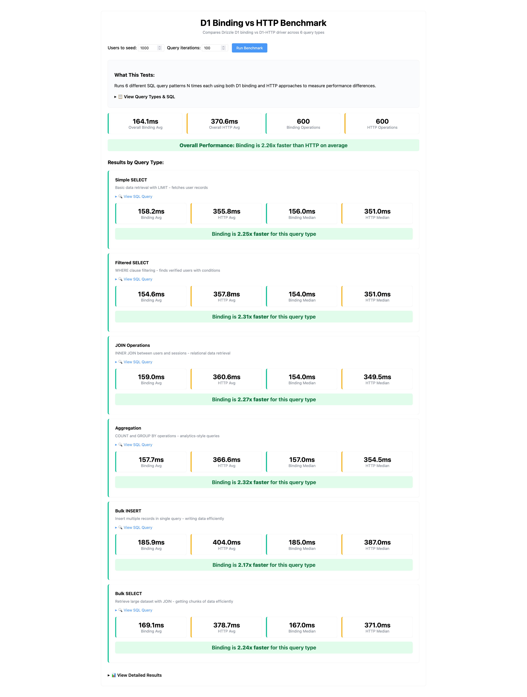

# D1 Binding vs HTTP Benchmark

> [!NOTE]
> This benchmark accompanies [drizzle-orm PR #4881](https://github.com/drizzle-team/drizzle-orm/pull/4881) which adds REST-based D1 HTTP driver support to Drizzle ORM.

A comprehensive performance benchmark comparing Cloudflare D1 database access via **direct binding** vs **HTTP API** from _within_ Cloudflare Workers. This tool helps quantify the performance benefits of using D1 bindings versus making HTTP requests to the D1 API from within the Cloudflare datacenter.

> [!IMPORTANT] > **Context**: The HTTP driver allows you to use Drizzle ORM with D1 outside of Cloudflare Workers (e.g., from CI/CD, other serverless platforms, or local scripts). This benchmark specifically focuses on the **latency differences within Cloudflare Workers** between using the HTTP driver versus direct bindings. This is particularly relevant for **multitenancy scenarios** where a single worker may need to access multiple D1 databases that aren't bound to the worker, requiring the HTTP driver even within the Cloudflare environment.

_Powered by [better-auth-cloudflare](https://github.com/zpg6/better-auth-cloudflare)_

## See the Results



## Run it Yourself - Quick Start

1. **Install dependencies:**

    ```bash
    pnpm install
    ```

2. **Configure `wrangler.toml`** (see [Configuration](#configuration) below)

3. **Create and migrate database:**

    ```bash
    wrangler d1 create your-database-name
    pnpm run db:migrate:prod
    ```

4. **Deploy to Cloudflare Workers:**

    ```bash
    pnpm run deploy
    ```

5. **Run benchmark:**
   Navigate to your deployed Worker URL at `/benchmark` to run the performance tests within Cloudflare's datacenter for accurate latency measurements.

## Configuration

Update these variables in `wrangler.toml`:

```toml
# Database Configuration
[[d1_databases]]
binding = "DATABASE"
database_name = "your-database-name"        # Replace with your DB name
database_id = "your-database-id"            # Replace with your DB ID

# API Access Variables
[vars]
CLOUDFLARE_ACCOUNT_ID = "your-account-id"   # Replace with your Cloudflare account ID
CLOUDFLARE_DATABASE_ID = "your-database-id" # Same as database_id above
CLOUDFLARE_API_TOKEN = "your-api-token"     # Replace with your API token with D1 permissions
```

### Getting Your Values

-   **Account ID**: Found in Cloudflare dashboard sidebar
-   **Database ID**: From `wrangler d1 create` command output or in dashboard
-   **API Token**: Create at [Cloudflare API Tokens](https://dash.cloudflare.com/profile/api-tokens) with D1:Edit permissions

## Available Scripts

-   `pnpm run deploy` - Deploy to Cloudflare Workers
-   `pnpm run db:migrate:prod` - Apply database migrations

## License

[MIT](./LICENSE)

## Contributing

Contributions are welcome! Whether it's bug fixes, feature additions, or documentation improvements, we appreciate your help in making this project better. For major changes or new features, please open an issue first to discuss what you would like to change.
